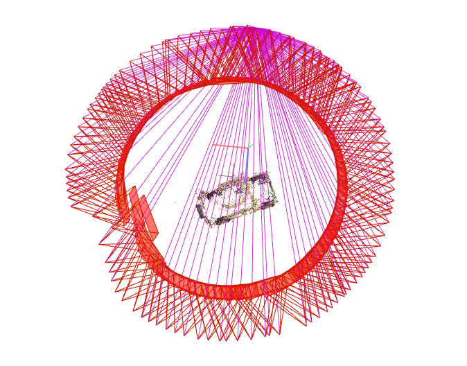

 
 
 
 
 
 
 
 
 
 
 
 

<b>

   Literature Notes

</h2></b>

 
 
 
 
 
 
 
 

<h4><b>

   Merakos Wang (Tongji University)

</h4></b>

<h4><b>

   jiewang.tj.cs@gmail.com

</h4></b>

 
 
 
 
 
 

 
 
 
 
 
 
 

<h7><b>

   $2023 / 7^{th} May$

</h7></b>

 
 
 
 
 
 
 
 

### Homemade data

#### Off-Road Vehicle

- **COLMAP**

- **Ground Truth**

- **Model View**

#### Roadster

- **COLMAP**

- **Ground Truth**

- **Model View**

- **Analysis of the results:** 
  - Roadster in COLMAP has part of the perspective missing, and the true value of the screen background black and car color differentiation is small, the overall effect is not good. off-road Vehicle white background, and COLMAP sparse map construction is better, but the vehicle details are poorly restored
- **Personal idea:** 
  - whether we can enter the symmetry in the reconstruction of the vehicle, so as to reduce the possibility of poor final results due to the missing part of the perspective

- **Homemade data experience:**
    - When producing the dataset, the number of images must not be too small, and ensure that there is a more obvious overlap of scenes from image to image;
    - the size of all pictures must be the same, otherwise COLMAP cannot complete feature extraction;
    - the lighting situation of each image must not be significantly different and the lighting situation of thescene must not be too poor (for scenes with large changes in lighting it is recommended to lock thecamera exposure)
    - obvious motion blur may affect the reconstruction quality and the training results may be affected;
    - the whole process of producing the dataset, when it comes to the file path problem, all cannot appear in Chinese, which may easily produce garbled codes;
    - In COLMAP reconstruction, many memory resources may be consumed, if there is a flashback, it is likely that the CPU/GPU memory is insufficient, it is recommended not to use too high resolution images (but the resolution is too low may lead to unsuccessful matching of poses or inaccurate matching of poses, please use the maximum resolution images when - memory allows).

#### SFM&COLMAP
- To obtain the camera pose, we need to estimate the relative pose between cameras using structure-from-motion technique. The open source software COLMAP, by inputting multiple images, can estimate the internal and external parameters (sparse model)
- **Steps:**
  - Feature point detection and extraction for all images
  - Feature point matching
  - Perform SFM to recover camera poses and sparse 3D feature points

### Experiment Summary

#### LLFF-generated NPY file
- load_llff.py will read the poses_bounds.npy file directly to get the camera parameters. poses_bounds.npy is an Nx17 matrix, where N is the number of images, i.e. 17 parameters per image. The first 15 parameters can be rearranged in the form of a 3x5 matrix
- The first 15 parameters of poses_bounds.npy. The left 3x3 matrix is the rotation matrix of c2w, the fourth column is the translation vector of c2w, and the fifth column is the height H, width W and camera focal length f of the image, respectively

$$\begin{bmatrix}
r_{11}&r_{12}&r_{13}&t_{1}&H\\
r_{21}&r_{22}&r_{23}&t_{2}&W\\
r_{31}&r_{32}&r_{33}&t_{3}&f\\
\end{bmatrix}$$

- The last two parameters are used to represent the range Bounds (bds) of the scene, which is the nearest (near) and farthest (far) distance of the scene point from the center of the camera in that camera view, so near/far must be greater than 0
- Colmap reconstruction 3D sparse points in each camera view nearest and farthest distance obtainable for voxel rendering, voxel rendering needs to sample 3D points on a ray, so a sampling interval is needed, and near and far are the nearest and farthest points that define the sampling interval. The near/far close to the scene boundary allows for a denser distribution of sampling points, which effectively improves convergence speed and rendering quality.

#### NeRF-Pytorch

- **forward**
 - Network forward calculation, return RGB+alpha
- **Data loading**
  - images [N,H,W,3], N represents the number of samples in the dataset
  - Poses [N,3,4]
  - bds [N,2]
  - render_poses [N_view,3,5],N_view is obtained for `render_Path_spiral()`
  - i_test:test_sample
  - i_val:validation_sample

- **NeRF model creation**
  - `render_kwargs_trainmrender_kwargs_test,start,grad_vars,optimizer=create_nerf(args)`
  - Initialization of MLP

- **Rendering**
  - `rgbs,_ = render_path(render_poses, hwf, K, args.chunk, render_kwargs_test, gt_imgs=images, savedir=testsavedir, render factor=args.renderfactor)`
  - Get the collection of images corresponding to render_poises
  - Convert images to mp4 via imageio.mimwrite

-  **Beam processing**
   -  `rays = np.stack([get_rays_np(H, W, K, p) for p in poses[:,:3,:4]].`
      - Get the beam and return [N,ro+rd, H,W,3]
      - ray_o indicates the pixel point coordinates
      - ray_d indicates the pixel point direction
    - `rays_rgb = np.stack([rays_rgb[il for i in i_train], 0)`  
      - Training set part
    - After reshape the beam, the size of (M,3,3) is obtained, where M is the number of all pixels in the training set 

- **iteration**
  - Processing beams
    - batch_rays,[or+od,batch,3] and target rgb
    - Finish the epoch and disrupt the beam
  - MLP+render
    - Render the information corresponding to each beam
      - Extract useful information
      - Calculate beam sampling points
        - `pt=rays_o+rays_d*z_val
        - MLP obtains rgb and density for each point
        - Volumn render for each beam multi-3D point, synthesize the color
    - Calculate loss using the rgb+target_s calculated in the previous step
    - Back propagation + learning rate adjustment

### Paper Summary:NeRF: Representing Scenes as Neural Radiance Fields for View Synthesis

####  Rendering
  - For a given camera ray, sample points on this ray
  - Using the sampled points and the direction of light entry, return the color and density of the points
  - Using the volume rendering method, gather the color and density of the points in the light path to generate the final 2D image.
- Finally, the generated 2D image is compared with the gt image to optimize the color and density.
- Advantages: avoids the requirement of storing high-resolution voxels, and instead implements the 3D reconstruction process through implicit coding, greatly reducing the space required to store scene information

#### Volume Rendering
  - color is obtained by integration, $T(t)$ denotes the transmission ratio, the longer the distance the light travels, the lower the transmission ratio. $\sigma(r(t))$ is the density.

#### position encoding
- The location information $(x,y,z)$ in space is a very low-dimensional representation, which is difficult to express for color and geometric information with rich variations, and the network can only learn low-frequency information from it. A common practice is to project it to a more high-dimensional space and expand the distance between points so that the network can learn more complex high-frequency information.

- The text uses a sin-cos function, which first normalizes the space coordinates to [-1,1], and then encodes them using the sin-cos function. This work raises the 3-dimensional position to 10 dimensions and the direction to 4 dimensions by this way.

#### Hierachical volume sampling：
- The idea of coarse+fine is to train a network of coarse samples first, and then to sample more carefully based on the output of the coarse network. In the final optimization, the coarse and fine samples are optimized together and both are used to generate the final result. loss also takes both into account.

#### Results:

- It is not very obvious from the evaluation metrics, but the pictures in the text clearly show the improvement of NeRF compared to other methods.

#### Comparison work
- **Neural volumes (NV)**
    - Background independent
    - Deep 3D convolutional network to perform prediction voxel grid.
    - 1283 samples are required
- **Scene Representation Network (SRN) & local Light Field Fusion (LLFF)**
    - 3D convolutional network to predict RGB and alpha grids
    - Generated 3D voxel grid with high storage overhead.

#### Ablation Study
- Check the necessity of each module

#### Summary
- **NeRF Process Summary**
  - **Data pre-processing**
      - Based on all image data, get camera internal reference (focal length, 1 parameter), camera pose (coordinate transformation, 12 parameters) and sparse 3D points (inference of the closest and farthest distance of the object from the camera, 2 parameters), and assign 17 parameters to each image (1+12+2+2, where the last 2 is the length and width of the image)
  - **Training**
    - Image + 17 parameters, get the imaging plane based on the camera pose and camera focal length, and limit the imaging range based on the aspect of the image. A position in the imaging plane (corresponding to a known real pixel value) is taken, and the line with the camera position forms a ray to obtain the two-dimensional viewpoint parameters, and n points are sampled within the nearest and farthest distances to obtain the three-dimensional position parameters, which form n five-dimensional vectors. Then, according to the camera position parameters are transformed to the world coordinate system and sent into the MLP to predict the rgb and sigma of each point. At this time, the sampled points are not directly supervised, but the fake pixel values are obtained according to the body rendering, and the training is supervised by the error between real and fake.
- **Personal summary:**
    - neural radiance field: essentially, this paper is trying to model the scene implicitly + rendering explicitly, i.e., the scene is modeled by neural network, while the scene is rendered, by traditional rendering

