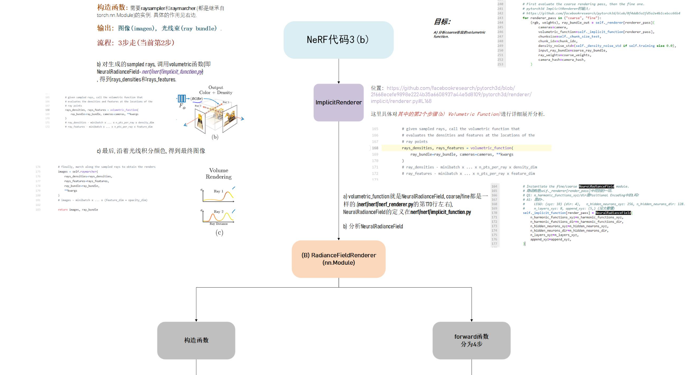
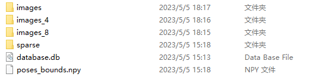

<center>
<br>
<br>
<br>
<br>
<br>
<br>
<br>


### NeRF-Pytorch Experiment

<br>
<br>
<br>
<br>


#### Member: <u>&nbsp;&nbsp;&nbsp;&nbsp;&nbsp;&nbsp;&nbsp;&nbsp;&nbsp;&nbsp;&nbsp;&nbsp;&nbsp;&nbsp;&nbsp;&nbsp;&nbsp;&nbsp;&nbsp;2054310 Wangjie&nbsp;&nbsp;&nbsp;&nbsp;&nbsp;&nbsp;&nbsp;&nbsp;&nbsp;&nbsp;&nbsp;&nbsp;&nbsp;&nbsp;&nbsp;&nbsp;&nbsp;&nbsp;&nbsp;</u>

#### Major: <u>&nbsp;&nbsp;&nbsp;&nbsp;&nbsp;&nbsp;Computer Science and Technology&nbsp;&nbsp;&nbsp;&nbsp;&nbsp;</u>


</center>
<br>
<br>
<br>
<br>
<br>
<br>
<br>
<br>
<br>

---


### Code Analysis：
####train
- **Data Loading:**
  - Get data
    - images[N,H,W,3]N is the number of data samples
    - poses[N,3,4]N is the number of data set samples
    - bds[N,2]bounds
    - render_poses[N_vies,3,5]the viewpoint needed to render the video
    - hwf height width focal length
  - **Data type**
    - llff
    - blender
    - LINEMOD
    - deepvoxel
  - **Create NeRF model**
    - Initialization of MLP
  - **Beam processing**
    - rays=np.stack(get_rayts_np...)
    - rays_rgb=np.concatenate([rays,images...])
    - Training set extraction reshape to get all beams
  -** Training iterations**
    - Process beams in batches
      - Get batch_rays and target rgb colors
      - MLP calculate +render all beams corresponding information
        - all_ret=batchfiy_rays
          - Return the result of the whole batch beam, including the rgb disp information
          - Calculate the chunk beams in the batch
            - ret=render_rays[rays_flat]
      - RGB and true value target_s to find loss
      - Reverse propagation
  - **Output**
    - Save checkpoing
    - Perform view synthesis on render_poses and get MP4
    - View synthesis on test samples to obtain new images      


- **Overall structure:**
  - The summary of sonner is quoted here with some notes based on it. Details are as follows:


<center></center>

<center></center>
<center></center>
<center></center>
<center></center>
<center></center>

## Dependencies
  - PyTorch 1.4
  - matplotlib
  - numpy
  - imageio
  - imageio-ffmpeg
  - configargparse

## Requirements
- torch==1.11.0
- torchvision>=0.9.1
- imageio
- imageio-ffmpeg
- matplotlib
- configargparse
- tensorboard>=2.0
- tqdm
- opencv-python

## Process

- Download two example datasets :`lego` and `fern`

- Create Conda environment, named Nerf python version 3.10.9
`conda create -n Nerf python 3.10.9`

- Switch the environments
`conda info --envs`
`conda activate Nerf`

- Pytorch
  - `pytorch-2.0.0`
  - `pytorch-cuda-11.8`
    - test on Anaconda Powershell Prompt
    - `conda activate Nerf`
    - `import torch`
    - `torch.cuda.is_available()`
      - output:True
- **Problems with running**:`Torch not compiled with CUDA enabled`
- **Analysis** ：No problem with CUDA versions，and downward compatible，input on anaconda powershell`conda list`
  - conda installed pytorch for the cpu version
    - Uninstall cpu version`conda uninstall pytorch`
    - pip :download Pytorch Build:Stable(2.0.0)
    - imageio-ffmpeg o,ageop[pyav]
    - After installation, continue to run


<center></center>

- Using RTX2070 running the official demo, the results are shown below:
<center></center>
- The log file is run as shown below.
<center></center>
<center></center>

- Since I am using RTX 2070 graphics card, the computing power is not enough, so I plan to connect to the server via ssh, Pycharm is the community version, which does not support remote ssh, so I try again to configure in vscode
  - vscode environment configuration
  - Python: Venv Folder
    - address is anaconda/env/
    - python: venv path is env/Nerf/python.exe
    - After configuration, you also need to add anaconda powershell prompt
    - You need to configure it successfully in vscode, then open it in ternimal and run torch.cuda.is_available(), which returns True
    - Try to execute `python run_nerf.py --config configs/lego.txt`, success


<center></center>
- **SSH Configuration**
  - powershell input`ssh`
  - Return：  usage: ssh [-46AaCfGgKkMNnqsTtVvXxYy] [-B bind_interface]
           [-b bind_address] [-c cipher_spec] [-D [bind_address:]port]
           [-E log_file] [-e escape_char] [-F configfile] [-I pkcs11]
           [-i identity_file] [-J [user@]host[:port]] [-L address]
           [-l login_name] [-m mac_spec] [-O ctl_cmd] [-o option] [-p port]
           [-Q query_option] [-R address] [-S ctl_path] [-W host:port]
           [-w local_tun[:remote_tun]] destination [command]
  - installation
<center></center>
- VSCODE remote-ssh prompt download
  -  ssh username@ip -p port connection
- SFTP Plugin Installation
  - ctrl+shift+p Run config sftp:config,open sftp.json
  - Template format:

```json
      {
          "name": "My Server",
          "host": "Server ip",
          "protocol": "sftp",
          "port": 22,
          "username": "server username",
          "password": "server code",
          "remotePath": "path",
          "ignore": [
              "**/.vscode/**",
              "**/.git/**",
              "**/logs/**",
              "**/__pycache__/**"
          ],
          "watcher": {
          "files": "*",
          "autoUpload": true,
          "autoDelete": true
          },
          "uploadOnSave": true,
          "downloadOnOpen":false,
          "useTempFile": false,
          "openSsh": false
      }

```
- **Virtual machine remote conda environment configuration and requirements installation**

<center></center>

- **Virtual machine Ubuntu conda environment configuration question:**
  - conda create -n W_nerf python 3.9.0 error
    - Problem: mirrors connection problem
    - Problem: conda create -n W_nerf python=3.9.0
- **ssh connection ssh username@ip -p port**
  - Creating a conda virtual environment
  - Switch and reinstall pytorch


    - `import torch`
    - `torch.cuda.is_available()`
  - `pip install -r requirements.txt`
  - python
  - CUDA error: CUBLAS_STATUS_EXECUTION_FAILED when calling `cublasSgemm( handle, opa, opb, m, n, k, &alpha, a, lda, b, ldb, &beta, c, ldc)`
    - **Analysis:**
      - The shape dimensions do not match
      - Variables are not on the same device
      - pytorch and cuda versions do not match
    - **Reason:** cuda version problem
      - pip uninstall torch
      - pip3 install torch torchvision torchaudio --index-url https://download.pytorch.org/whl/cu118
        - cuda_version = 12.0 ,supportive version,pytorch=2.0 
  -  `pip install -r requirements.txt` success:smile:


<center></center>

<center></center>

- Homemade dataset
  - Find a vehicle model on SKETCHFAB to generate a 360 degree surround video.

<center></center>

  - Then the frames are drawn to obtain 72 consecutive interval images.


<center></center>


- **COLMAP download and use**
  - COLMAP: COLMAP is a general purpose motion structure (SfM) and multi-view stereo (MVS) processing tool with a graphical and command line interface. It offers a wide range of capabilities for the reconstruction of ordered and unordered image collections. This project uses the tool for photo pose estimation
  - https://link.zhihu.com/?target=https%3A//github.com/colmap/colmap/releases
  - The downloaded version is COLMAP-3.6-windows-cuda
  - Double click on the COLMAP.bat file to run the tool. Also click on new project under file, select the project path and image path, then save it.
  - Click feature extraction under process to extract features (default parameters), close it after finishing
  - Click feature match under process for feature matching (default parameters), and close after finishing.
  - After the feature extraction and feature matching, use the start reconstruction under reconstruction to reconstruct, the result is as follows


<center></center>

  - Export the recovered photo bitmap data, create a new sparse folder under Doraemon folder, then create a new 0 folder, click file->Export model, and choose to export the data to the 0 folder. Finally, compress and upload the files in the Doraemon folder to the work folder.

<center></center>


- **Generate LLFF format data**


- **LLFF's tensorflow version is too old, modify requirements**

```python
jupyterlab
tensorflow-gpu == 2.9
matplotlib
scipy
numpy
scikit-image
imageio == 2.4.0
```


- **ERROR: Exception:**
  `Traceback (most recent call last):`

- Problem: Access timeout cause
- Solution: Add domestic source
easy_install --upgrade pip
easy_install -i https://pypi.doubanio.com/simple/ --upgrade pip
pip install lightgbm -i http://pypi.douban.com/simple --trusted-host pypi.douban.com
- Specify the mirror source to download and resolve


- **ERROR**
  - `ERROR: the correct camera poses for current points cannot be accessed`
  - Two of the previous images were found to have a large deviation in position, so they were deleted and regenerated, and the results are shown below:
 <center></center>


- **RESULTS**
```
Don't need to run COLMAP
Post-colmap
Cameras 5
Images # 72
Points (4720, 3) Visibility (4720, 72)
Depth stats 0.0002389144825367745 46.016071181966105 3.9517191525092605
Done with imgs2poses
```


- success:smile:
- generatge poses_bounds.npy

<center></center>


- **ERROR**
```
Minifying 8 ./data/nerf_llff_data/car
mogrify -resize 12.5% -format png *.jpg
/bin/sh: 1: mogrify: not found
Traceback (most recent call last):
  File "/home/ps/NeRF/nerf-pytorch-master/run_nerf.py", line 878, in <module>
    train()
  File "/home/ps/NeRF/nerf-pytorch-master/run_nerf.py", line 542, in train
    images, poses, bds, render_poses, i_test = load_llff_data(args.datadir, args.factor,
  File "/home/ps/NeRF/nerf-pytorch-master/load_llff.py", line 246, in load_llff_data
    poses, bds, imgs = _load_data(basedir, factor=factor) # factor=8 downsamples original imgs by 8x
  File "/home/ps/NeRF/nerf-pytorch-master/load_llff.py", line 76, in _load_data
    _minify(basedir, factors=[factor])
  File "/home/ps/NeRF/nerf-pytorch-master/load_llff.py", line 51, in _minify
    check_output(args, shell=True)
  File "/home/ps/anaconda3/envs/W_nerf/lib/python3.9/subprocess.py", line 420, in check_output
    return run(*popenargs, stdout=PIPE, timeout=timeout, check=True,
  File "/home/ps/anaconda3/envs/W_nerf/lib/python3.9/subprocess.py", line 524, in run
    raise CalledProcessError(retcode, process.args,
subprocess.CalledProcessError: Command 'mogrify -resize 12.5% -format png *.jpg' returned non-zero exit status 127.
```

- Analysis: Observe the given data file and find that there are downsampled files, so we need to downsample the existing images by 4 and 8 and put them into data as well

- Execute the following code to generate, and name it images_4,images_8

- After running, continue to execute
```

(Nerf) PS F:\Nerf\nerf-pytorch-master\nerf-pytorch-master> python run_nerf.py --config configs/car.txt
Loaded image data (98, 179, 3, 72) [ 98.         179.         117.81072966]
Loaded ./data/nerf_llff_data/car 0.00030286735422229875 45.89327339330524
OMP: Error #15: Initializing libiomp5md.dll, but found libiomp5md.dll already initialized.
OMP: Hint This means that multiple copies of the OpenMP runtime have been linked into the program. That is dangerous, since it can degrade performance or cause incorrect results. The best thing to do is to ensure that only a single OpenMP runtime is linked into the process, e.g. by avoiding static linking o
f the OpenMP runtime in any library. As an unsafe, unsupported, undocumented workaround you can set the environment variable KMP_DUPLICATE_LIB_OK=TRUE to allow the program to continue to execute, but that may cause crashes or silently produce incorrect results. For more information, please see http://www.in
tel.com/software/products/support/.
```

- Error , libiomp5md.dll. There are two libiomp5md.dll files in the environment of anaconda. So go directly to the path of the virtual environment and search for this file, you can see that there are two dll files in the environment: you can delete one, or add at the beginning·`os.environ['KMP_DUPLICATE_LIB_OK']='TRUE'`


```

Traceback (most recent call last):
  File "/home/ps/NeRF/nerf-pytorch-master/run_nerf.py", line 878, in <module>
    train()
  File "/home/ps/NeRF/nerf-pytorch-master/run_nerf.py", line 542, in train
    images, poses, bds, render_poses, i_test = load_llff_data(args.datadir, args.factor,
  File "/home/ps/NeRF/nerf-pytorch-master/load_llff.py", line 246, in load_llff_data
    poses, bds, imgs = _load_data(basedir, factor=factor) # factor=8 downsamples original imgs by 8x
  File "/home/ps/NeRF/nerf-pytorch-master/load_llff.py", line 114, in _load_data
    imgs = imgs = [imread(f)[...,:3]/255. for f in imgfiles]
  File "/home/ps/NeRF/nerf-pytorch-master/load_llff.py", line 114, in <listcomp>
    imgs = imgs = [imread(f)[...,:3]/255. for f in imgfiles]
  File "/home/ps/NeRF/nerf-pytorch-master/load_llff.py", line 110, in imread
    return imageio.imread(f, ignoregamma=True)
  File "/home/ps/anaconda3/envs/Nerf/lib/python3.10/site-packages/imageio/__init__.py", line 97, in imread
    return imread_v2(uri, format=format, **kwargs)
  File "/home/ps/anaconda3/envs/Nerf/lib/python3.10/site-packages/imageio/v2.py", line 349, in imread
    result = file.read(index=0, **kwargs)
TypeError: PillowPlugin.read() got an unexpected keyword argument 'ignoregamma'
```


- Version problem of imageio
- pip list found imageio version=2.28.1, uninstall and download 2.8.1


- **Homemade data experience:**

  - When producing the dataset, the number of images must not be too small, and ensure that there is a more obvious overlap of scenes from image to image;
  - the size of all pictures must be the same, otherwise COLMAP cannot complete feature extraction;
  - the lighting situation of each image must not be significantly different and the lighting situation of the scene must not be too poor (for scenes with large changes in lighting it is recommended to lock the camera exposure)
  - obvious motion blur may affect the reconstruction quality and the training results may be affected;
  - the whole process of producing the dataset, when it comes to the file path problem, all cannot appear in Chinese, which may easily produce garbled codes;
  - In COLMAP reconstruction, many memory resources may be consumed, if there is a flashback, it is likely that the CPU/GPU memory is insufficient, it is recommended not to use too high resolution images (but the resolution is too low may lead to unsuccessful matching of poses or inaccurate matching of poses, please use the maximum resolution images when - memory allows).


**extraction code：**

```python
# -*- coding:utf8 -*-
import cv2
import os
import shutil


def get_frame_from_video(video_name, interval):
    """
    Args:
        video_name:输入视频名字
        interval: 保存图片的帧率间隔
    Returns:
    """

    # 保存图片的路径
    save_path = video_name.split('.mp4')[0] + '/'
    is_exists = os.path.exists(save_path)
    if not is_exists:
        os.makedirs(save_path)
        print('path of %s is build' % save_path)
    else:
        shutil.rmtree(save_path)
        os.makedirs(save_path)
        print('path of %s already exist and rebuild' % save_path)

    # 开始读视频
    video_capture = cv2.VideoCapture(video_name)
    i = 0
    j = 0

    while True:
        success, frame = video_capture.read()
        i += 1
        if i % interval == 0:
            # 保存图片
            j += 1
            save_name = save_path + str(j) + '.jpg'
            cv2.imwrite(save_name, frame)
            print('image of %s is saved' % save_name)
        if not success:
            print('video is all read')
            break


if __name__ == '__main__':
    video_name = './233.mp4'  # 视频文件名字
    interval = 5
    get_frame_from_video(video_name, interval)


```

**Car_Config:**

```python
  expname = fern_test
  basedir = ./logs
  datadir = ./data/nerf_llff_data/car
  dataset_type = llff

  factor = 8
  llffhold = 8

  N_rand = 1024
  N_samples = 64
  N_importance = 64

  use_viewdirs = True
  raw_noise_std = 1e0


```

**Customized dataset catalog structure**

```python
+── images # 对应重建图片数据集
│   +── image1.jpg
│   +── image2.jpg
│   +── ...
+── sparse # 稀疏重建结果
│   +── 0
│   │   +── cameras.bin
│   │   +── images.bin
│   │   +── points3D.bin
│   │   +── 对应的.txt  #如果保存了的话
│   +── ...
+── dense # 稠密重建结果
│   +── 0
│   │   +── images # 去畸变图像
│   │   +── sparse
│   │   +── stereo
│   │   +── fused.ply # 稠密点云
│   │   +── meshed-poisson.ply
│   │   +── meshed-delaunay.ply
│   +── ...
+── database.db # 图像提取的特征相关信息
+── project.ini # 项目信息文件

```
